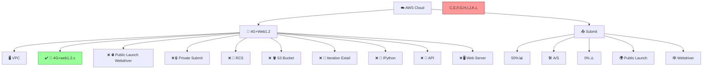

# AWS-Two-Tier-Architecture-using-Terraform
This AWS architecture deploys a highly available web app using Terraform. An ALB routes traffic to EC2 instances in public subnets across two AZs, which access private RDS databases. An S3 bucket offers object storage and stores the Terraform state securely within the same VPC.



# 🛠️ Project Structure
The project is organized as follows:
``` bash
CLOUD-INFRA/
├── .terraform/                   # Terraform cache directory
│   └── plugins/                  # Provider plugins
├── modules/
│   ├── ec2/                      # Compute module
│   │   ├── templates/
│   │   │   └── user_data.sh.tpl  # Cloud-init template
│   │   ├── main.tf               # EC2 instances
│   │   ├── outputs.tf            # Instance outputs
│   │   └── variables.tf          # Size/AMI vars
│   │
│   ├── vpc/                      # Network module
│   │   ├── main.tf               # VPC/Subnets
│   │   ├── outputs.tf            # Network IDs
│   │   └── variables.tf          # CIDR vars
│   │
│   ├── rds/                      # Database module
│   │   ├── main.tf               # Aurora/MySQL
│   │   ├── outputs.tf            # Endpoints
│   │   └── variables.tf          # DB configs
│   │
│   └── lb/                       # Load Balancer
│       ├── main.tf               # ALB/NLB
│       ├── outputs.tf            # DNS names
│       └── variables.tf          # LB specs
│
├── main.tf                       # Core resources
├── providers.tf                  # AWS/Cloud config
├── variables.tf                  # Global variables
├── outputs.tf                    # Stack outputs
├── terraform.tfvars              # Env variables
└── backend.tf                    # S3 state config 
```
# 🧩 Architecture Components
Custom VPC: A virtual private cloud with defined CIDR blocks to host the infrastructure.

Subnets:
Public Subnets: Two subnets for the web server tier, each in a different Availability Zone (AZ) to ensure high availability.
Private Subnets: Two subnets for the RDS tier, also distributed across different AZs.

Route Tables:
Public Route Table: Associated with public subnets and connected to an Internet Gateway for external access.
Private Route Table: Associated with private subnets and connected to a NAT Gateway for secure outbound internet access.

Internet Gateway & NAT Gateway:
Internet Gateway: Allows internet access for resources in public subnets.

EC2 Instances:
Deployed in public subnets with Apache web servers installed via user data scripts.

RDS MySQL Instance:
Hosted in private subnets to store application data securely.

Security Groups:
Configured to allow HTTP traffic to web servers and MySQL traffic between web servers and the database.


Terraform Modules:
Used to organize and reuse code efficiently, promoting scalability and maintainability.


